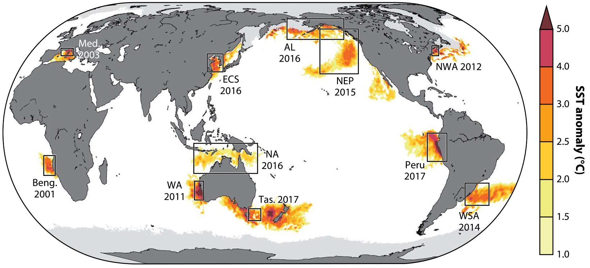

```{r setup, include=FALSE}
knitr::opts_chunk$set(echo = TRUE)
library(tidyverse)
library(here)
library(raster)
library(lubridate)
library(sf)
library(viridis)
library(zoo)
library(gganimate)
library(ggspatial)
library(rnaturalearth)
library(rnaturalearthdata)
library(ggrepel)
library(plotly)
library(maps)
library(cmocean)
```

# Marine Heatwaves Impacts on Fisheries

Marine heatwaves (MHWs) are one aspect of climate change that are already having a significant impact on fisheries. MHWs are short-term extreme warming events that occur globally often linked to disruptive changes on ecosystem services, such as fisheries, with extensive socioeconomic consequences.

```{r, fig.cap="Figure from Oliver et al. 2021", fig.align="center"}
#loading in northern region data

```


# How MHWs Are Impacting U.S. Fisheries?
The anomalous warmer water temperatures associated with MHWs can create physiological stressful environments for marine species if thermal thresholds are exceeded, leading to a wide range of impacts on marine ecosystems such as mass mortalities and strandings, shifts in species distributions, and altered ecosystem structure and functioning. 

Regional case studies have shown that these ecological responses to MHWs are linked to pervasive socioeconomic impacts on fisheries, such as shifts in fishing grounds and reduced fisheries yields or distribution changes for species of conservation concern.

**Insert infographic**
```{r}
# MAB_NEC_NED_MHW<-here("data","water_temp","NWA","oisst",
#                       "MAB_NEC_NED_MHW.rds") %>% readRDS() 
# 
# MHW_contour<-MAB_NEC_NED_MHW %>% filter(year == 2012) %>%
#   group_by(lat,lon) %>% 
#   summarise(temp_anomaly = mean(temp_anomaly, na.rm=TRUE),
#             seas = mean(seas, na.rm=TRUE),
#             .groups = "drop") %>%
#   mutate(MHW = if_else(temp_anomaly >= seas, 1, 0)) %>% 
#   # sf::st_as_sf(coords = c("lon","lat"), crs = "+proj=longlat +ellps=WGS84 +datum=WGS84 +no_defs +towgs84=0,0,0") %>% 
#   # mutate(lon = sf::st_coordinates(.)[,1],
#   #        lat = sf::st_coordinates(.)[,2]) %>% 
#   # st_union() %>% 
#   # st_buffer(1000) %>% st_transform(crs = "+proj=longlat +ellps=WGS84 +datum=WGS84 +no_defs +towgs84=0,0,0")
#   dplyr::select(lon,lat,MHW) %>% 
#   rasterFromXYZ() %>% 
#   rasterToContour() %>% 
#   st_as_sf()
#   
# st_crs(MHW_contour)<-"+proj=longlat +ellps=WGS84 +datum=WGS84 +no_defs +towgs84=0,0,0"
# 
# MHW_contour<-st_intersection(world %>% filter(name == "United States"),MHW_contour)
# 
# world <- ne_countries(scale = "medium", returnclass = "sf")
# 
# ggplot() +
#   geom_sf(data = MHW_contour, fill = "red") +
#   #geom_tile(aes(x=lon,y=lat, fill = temp_anomaly))+
#   #geom_point(NWA_PLL_2019, mapping = aes(x=X, y=Y)) + 
#   #geom_sf(data = NWA_PLL_zones, color = "goldenrod3", fill=NA)+
#   #geom_contour(aes(x=lon,y=lat, z = temp_anomaly),binwidth = 5)+
#   geom_sf(data = world, color= "black", fill = NA) +
#   scale_size(range = c(1, 8), name=expression("Proportion\nof MHW"(km^2)))+
#   coord_sf(xlim = c(-75, -61), ylim = c(35.7, 45), expand = TRUE) +
#   ylab("Latitude") + xlab("Longitude") + theme_classic()
# #+scale_fill_viridis(discrete=FALSE, option="turbo",
#                      #name=stringr::str_wrap("SSTa\nMagnitude (°C)", width = 13))
```

# MHWs Come In Many Flavors
Because each MHW is caused by a range of complex oceanographic and atmospheric processes, a single MHW event can have differential impacts on fishing fleets, fishing management areas, and fishing communities.

To better understand how marine heatwaves have already impacted US fisheries, we used shipboard tracking data to map how two US fleets - the pelagic longline fleet in the Northwest Atlantic (NWA) and the trolling fleet in the Northeast Pacific (NEP) - responded to MHWs from 2012-2020.

```{r, fig.cap= "NWA longline fleet responses to varying MHWs during the fall season (Sep, Oct, Nov)",fig.align="center"}
world <- ne_countries(scale = "medium", returnclass = "sf")

MAB_NEC_NED_MHW<-here("data","water_temp","NWA","oisst",
                       "MAB_NEC_NED_MHW.rds") %>% readRDS()

GOM_CAR_FEC_SAR_SAB_MHW<-here("data","water_temp","NWA","oisst",
                       "GOM_CAR_FEC_SAR_SAB_MHW.rds") %>% readRDS()
all_zone<-rbind(MAB_NEC_NED_MHW,GOM_CAR_FEC_SAR_SAB_MHW)

rm(MAB_NEC_NED_MHW,GOM_CAR_FEC_SAR_SAB_MHW)

NWA_flavors<-all_zone %>% filter(year %in% c(2012,2015,2016,2018,2019)) %>% 
  mutate(year = factor(year, levels = c(2012,2015,2016,2018,2019))) 
# %>% 
#   st_as_sf(coords=c("lon","lat"), crs = 4326) %>% st_transform(crs = 5070)

# NWA_PLL<-here("data","AIS_processed","NWA_PLL",
#               "Pres_Abs_2013to2020_NWA_USA_PLL_onlyfishing_v2_1to1ratio_absenceconstrained_convexhull_v2_enhanced.rds") %>% readRDS()
# 
# NWA_PLL_flavors<-NWA_PLL %>% filter(month %in% c(9,10,11) &
#                                       year %in% c(2015,2017,2019,2018) &
#                                       Pres_abs == 1) %>% 
#   mutate(year = factor(year, levels = c("2018","2015",
#                                         "2019","2017")),
#          Geartype = ifelse(Pres_abs == 1,"Longline","none"))


NWA_flavors %>%
  group_by(lat,lon,year) %>% 
  summarise(temp_anomaly = mean(temp_anomaly, na.rm=TRUE),.groups = "drop") %>% 
  #mutate(date = as.factor(yearmon)) %>% 
  ggplot() +
  geom_tile(aes(x=lon,y=lat, fill = temp_anomaly))+
  # geom_point(NWA_PLL_flavors, mapping = aes(x=X, y=Y, color = Geartype), 
  #            shape = 1) +
  geom_sf(data = world, color= "black", fill = "grey") +
  scale_size(range = c(1, 8), name=expression("Proportion\nof MHW"(km^2)))+
  coord_sf(xlim = c(-100, -40), ylim = c(20, 50), expand = TRUE) +
  theme_classic()+
  # labs(x = expression(weak%<-%Intensity%->%strong),
  #      y = expression(small%<-%Size%->%large))+
  labs(fill = "SSTa Magnitude (°C)")+
  facet_wrap(~year)+
  scale_fill_cmocean(name="balance",
                     limits = c(-2,2),oob = scales::squish,
                     labels=c("\u2264 -2","-1","0","1","\u2265 2"))+
  #scale_color_manual(values = "black")+
  theme(legend.position="bottom")+
  theme(strip.background = element_blank())+
  guides(fill = guide_colorbar(title.position="top", title.hjust = 0.5))
```


# Fishing Area Gains and Losses

To understand how fisheries are responding to MHWs, we took a management zone approach... 

## Northwest Atlantic  Pelagic Longline Fishery
```{r, fig.cap= "U.S. Atlantic Pelagic longline management zones",fig.align="center"}
#mangement zones shapefile
NWA_PLL_zones<-here("data","shapefiles","Zones_PLL.shp") %>% sf::st_read(crs = "+proj=longlat +ellps=WGS84 +datum=WGS84 +no_defs +towgs84=0,0,0", quiet = TRUE) %>% st_transform()

#center coordinates for each mgmt_zone
mgmtzone_centroid<-NWA_PLL_zones %>% st_centroid() %>% st_coordinates() %>% as.data.frame() %>% suppressWarnings()

mgmtzone_centroid<-cbind(NWA_PLL_zones$ET_ID,mgmtzone_centroid)

colnames(mgmtzone_centroid)<-c("mgmt_zone","X","Y")

ggplot() +
  geom_sf(data = NWA_PLL_zones, color = "goldenrod3", fill=NA)+
  geom_sf(data = world, color= "black", fill = "grey")+
  geom_label_repel(data = mgmtzone_centroid, aes(x = X, y = Y, 
                                                 label = mgmt_zone), 
                   fontface = "bold",
                   box.padding = 3.5,
                   segment.size = 1,
                   max.overlaps = Inf,
                   )+
  theme_bw()+
  coord_sf(xlim = c(-100, -20), ylim = c(0, 55), expand = TRUE)+
  labs(y = "Latitude", x = "Longitude")
```

#Changes in Suitable Fishing Habitat
```{r}
VDM_stack<-stack(here("data","Monthly_Spatial_Predictions","NWA_PLL","NWA_PLL_monthly_predictions_2012to2020.nc"))%>% suppressMessages()

tt<-as.yearmon(seq(as.Date("2012-01-01"),as.Date("2020-12-01"),by="month"))

VDM_stack<-setZ(VDM_stack,tt)

tt <-tt[tt %in% as.yearmon("Sep 2015")]

#subset to just Sep 2015
VDM_Sep_2015<-subset(VDM_stack, which(getZ(VDM_stack) %in% tt)) %>% 
  rasterToPoints() %>% as_tibble()

colnames(VDM_Sep_2015)<-c("x","y","suitability")

VDM_Sep_2015<-VDM_Sep_2015 %>% st_as_sf(coords = c("x","y"), crs = "+proj=longlat +ellps=WGS84 +datum=WGS84 +no_defs +towgs84=0,0,0")%>% 
  mutate(lon = sf::st_coordinates(.)[,1],
         lat = sf::st_coordinates(.)[,2])

sf_use_s2(FALSE) %>% suppressMessages()

VDM_Sep_2015 <- st_join(VDM_Sep_2015,NWA_PLL_zones) %>% as_tibble() %>% 
  filter(ET_ID %in% c("MAB","NEC","NED")) %>% suppressMessages()


#subset to Sep 2015
df<-NWA_flavors %>% filter(year == 2015) %>%
  rename("mgmt_zone"="ET_ID") %>% 
  mutate(temp_anomaly = signif(temp_anomaly,3))


# geo styling
g <- list(
  scope = 'north america',
  showland = TRUE,
  landcolor = toRGB("grey83"),
  subunitcolor = toRGB("white"),
  countrycolor = toRGB("white"),
  showlakes = TRUE,
  lakecolor = toRGB("white"),
  showsubunits = TRUE,
  showcountries = FALSE,
  resolution = 50,
  projection = list(
    type = 'azimuthal equal area',
    rotation = list(lon = -100)
  ),
  lonaxis = list(
    showgrid = TRUE,
    gridwidth = 0.5,
    range = c(-100, -40),
    dtick = 5
  ),
  lataxis = list(
    showgrid = TRUE,
    gridwidth = 0.5,
    range = c(35, 55),
    dtick = 5
  )
)


#dropdown
#zones<-df %>% dplyr::pull(mgmt_zone) %>% unique()

all_buttons <- list(
  list(
    label = "MAB",
    method = "restyle",
    args = list(
      list(visible = c(TRUE,FALSE,FALSE)),
      list(markers = list(
        list(
             visible = df %>% dplyr::filter(mgmt_zone == "MAB") %>% 
                          dplyr::pull(temp_anomaly)),
             c(),c())))),
  
  list(
    label = "NEC",
    method = "restyle",
    args = list(
      list(visible = c(FALSE,TRUE,FALSE)),
      list(markers = list(c(),
        list(
             visible = df %>% dplyr::filter(mgmt_zone == "NEC") %>% 
                          dplyr::pull(temp_anomaly)),
             c())))),
  
  list(
    label = "NED",
    method = "restyle",
    args = list(
      list(visible = c(FALSE,FALSE,TRUE)),
      list(markers = list(c(),c(),
        list(
             visible = df %>% dplyr::filter(mgmt_zone == "NED") %>% 
                          dplyr::pull(temp_anomaly))
             )))))


#sliders
udates<-df$yearmon %>% unique()


all_dates <- list()
for (i in 1:length(udates)) {
  all_dates[[i]] <- list(
    label = udates[i],
    method = "restyle",
    args = list(
      list(visible = df %>% dplyr::filter(yearmon == udates[i]))
      )
  )
}


# annotations
annot <- list(x = 0, y=0.8, text = "Management\nZone", yanchor = 'bottom', 
              xref = 'paper', xanchor = 'right',
              showarrow = FALSE)

# original interactive map
fig<- plot_geo(df) 
fig <- fig %>% group_by(mgmt_zone) 
fig <- fig %>% add_markers(x = ~lon, y = ~lat, 
                           color = ~temp_anomaly, colors = turbo(99),
                           text = ~paste(df$temp_anomaly, "°C"), hoverinfo = "text") %>% 
  colorbar(title = "SSTa (°C)")


fig <- fig %>% layout(
  showlegend = FALSE, geo = g
)


# plot with custom events
fig <- fig %>% layout(annotations = annot,
                      updatemenus = list(list(active = 0, x = 0, y = 0.8, 
                                              buttons=all_buttons)),
                      sliders = list(

                        list(
                          active = udates,
                          currentvalue = list(prefix = "Dates: "),

                          steps = all_dates)
                        )
                      )

fig


# fig <- plot_geo(df, lat = ~lat, lon = ~lon, color = ~temp_anomaly,
#                 colors = turbo(99))
# fig <- fig %>% add_markers(
#     text = ~paste(df$temp_anomaly, "°C"), hoverinfo = "text") %>% 
#   colorbar(title = "SSTa (°C)")
# fig <- fig %>% layout(title = '', geo = g)
# 
# fig

```

```{r}
df<-NWA_flavors %>% filter(yearmon == as.yearmon("Sep 2015")) %>%
  rename("mgmt_zone"="ET_ID") %>% 
  mutate(temp_anomaly = signif(temp_anomaly,3))

subplot(
  plot_geo(df,x = ~lon, y = ~lat, 
                           color = ~temp_anomaly, colors = turbo(99)) %>% 
    add_markers(text = ~paste(df$temp_anomaly, "°C"), hoverinfo = "text") %>%
    colorbar(title = "SSTa (°C)") %>% 
    layout(showlegend = FALSE, geo = g),
  
  plot_geo(VDM_Sep_2015,x = ~lon, y = ~lat, 
                           color = ~suitability, colors = mako(99)) %>% 
    add_markers(text = ~paste(VDM_Sep_2015$suitability), hoverinfo = "text") %>%
    colorbar(title = "Fishing Suitability") %>% 
    layout(showlegend = FALSE, geo = g)
)

fig<- plot_geo(df) 
fig <- fig %>% group_by(mgmt_zone) 
fig <- fig %>% add_markers(x = ~lon, y = ~lat, 
                           color = ~temp_anomaly, colors = turbo(99),
                           text = ~paste(df$temp_anomaly, "°C"), hoverinfo = "text") %>% 
  colorbar(title = "SSTa (°C)")


fig <- fig %>% layout(
  showlegend = FALSE, geo = g
)
```


## Shifts in Spatial Distribution

**Thinking this would be a slider again but instead of two plots it will be SST anomaly and then vessel suitability center of gravity for each management zone. Pretty much what we have for the CCS Futures**
```{r}
world <- ne_countries(scale = "medium", returnclass = "sf")
sf_use_s2(FALSE)# need to do this to remove spherical geometry

#############################################
#load in mgmt zone shapefiles
#############################################

#mangement zones shapefile
NWA_PLL_zones<-here("data","shapefiles","Zones_PLL.shp") %>% sf::st_read(crs = "+proj=longlat +ellps=WGS84 +datum=WGS84 +no_defs +towgs84=0,0,0")

NWA_PLL_zones<-st_transform(NWA_PLL_zones)

#######################################################
#IDing MHW months by spatially averaging w/in mgmt zone
#######################################################

#loading in northern region data
MAB_NEC_NED_MHW<-here("data","water_temp","NWA","oisst",
                      "MAB_NEC_NED_MHW.rds") %>% readRDS()

MAB_NEC_NED_MHW$yearmon<-zoo::as.yearmon(MAB_NEC_NED_MHW$yearmon)

#averaging over the pixels per mgmt zone and yearmon
MAB_NEC_NED_MHW<-MAB_NEC_NED_MHW %>% 
  filter(yearmon >= 2012) %>% 
  group_by(yearmon, ET_ID) %>% 
  summarise(detrend = mean(detrend, na.rm=TRUE),
            seas = mean(seas, na.rm=TRUE), .groups = "drop") %>%
  mutate(MHW = ifelse(detrend >= seas, 1, 0)) %>%
  #categorizing the intensity of the MHW
  mutate(MHW_category = case_when(detrend >= seas*1.75 ~ "Extreme",
                             detrend >= seas*1.5 ~ "Severe",
                             detrend >= seas*1.25 ~ "Strong",
                             detrend >= seas ~ "Moderate",
                             TRUE ~ "Near-Average"))

#loading in southern region
GOM_CAR_FEC_SAR_SAB_MHW<-here("data","water_temp","NWA","oisst",
                              "GOM_CAR_FEC_SAR_SAB_MHW.rds") %>% readRDS()

#averaging over the pixels per mgmt zone and yearmon
GOM_CAR_FEC_SAR_SAB_MHW<-GOM_CAR_FEC_SAR_SAB_MHW %>% 
  filter(yearmon >= 2012) %>%
  group_by(yearmon, ET_ID) %>% 
  summarise(detrend = mean(detrend, na.rm=TRUE),
            seas = mean(seas, na.rm=TRUE), .groups = "drop") %>%
  mutate(MHW = ifelse(detrend >= seas, 1, 0)) %>% 
  #categorizing the intensity of the MHW
  mutate(MHW_category = case_when(detrend >= seas*1.75 ~ "Extreme",
                                  detrend >= seas*1.5 ~ "Severe",
                                  detrend >= seas*1.25 ~ "Strong",
                                  detrend >= seas ~ "Moderate",
                                  TRUE ~ "Near-Average"))


#combine
MHW_mgmtzone_all<-rbind(MAB_NEC_NED_MHW,GOM_CAR_FEC_SAR_SAB_MHW) %>% 
  rename("mgmt_zone"="ET_ID",
         "date"="yearmon")

MHW_mgmtzone_all$mgmt_zone<-factor(MHW_mgmtzone_all$mgmt_zone,
                                   levels = c("NED","NEC","MAB",
                                              "SAB","SAR","FEC",
                                              "GOM","CAR"))

rm(MAB_NEC_NED_MHW,GOM_CAR_FEC_SAR_SAB_MHW)


#combine PLL landscape metric datasets 
NWAPLL_MHW_summer<-here("data","Mgmt_zone","NWAPLL_MHW_summer.rds") %>% readRDS()
NWAPLL_MHW_winter<-here("data","Mgmt_zone","NWAPLL_MHW_winter.rds") %>% readRDS()
NWAPLL_MHW_total<-rbind(NWAPLL_MHW_summer,NWAPLL_MHW_winter) %>% ungroup()


#tiding up the data
NWAPLL_MHW_total$MHW<-factor(NWAPLL_MHW_total$MHW,
                             levels = c("Large MHW","Small MHW","Near-Average"))

NWAPLL_MHW_total<-NWAPLL_MHW_total %>% mutate(year = lubridate::year(date))

NWAPLL_MHW_total$mgmt_zone<-factor(NWAPLL_MHW_total$mgmt_zone,
                                   levels = c("NED","NEC","MAB",
                                              "SAB","SAR","FEC",
                                              "GOM","CAR"))


#joining the two
NWAPLL_MHW_total<-NWAPLL_MHW_total %>% 
  left_join(., MHW_mgmtzone_all, by=c("mgmt_zone","date")) %>% 
  rename("size_category"="MHW.x","MHW"="MHW.y")


########################################
#Finding the event duration for each MHW
########################################

#indexing each event by mgmt_zone
NWAPLL_MHW_total<-NWAPLL_MHW_total %>%
  dplyr::select(date,mgmt_zone,MHW) %>%
  group_by(mgmt_zone) %>%
  mutate(event_index = data.table::rleid(MHW)) %>% ungroup() %>% 
  left_join(., NWAPLL_MHW_total, by=c("date", "mgmt_zone","MHW"))

#counting the duration months and the sequence for each event
NWAPLL_MHW_total<-NWAPLL_MHW_total %>%
  group_by(mgmt_zone, event_index, MHW) %>% 
  summarise(duration_months = n(), .groups = "drop") %>%
  ungroup() %>% 
  left_join(., NWAPLL_MHW_total, 
            by=c("mgmt_zone","MHW", "event_index")) %>% 
  group_by(mgmt_zone, event_index) %>%
  mutate(sequence_months = seq_along(event_index)) %>% 
  ungroup() 
# %>%
#   mutate(sequence_months = ifelse(MHW == 0,NA,sequence_months))

#taking the average metrics for each event
NWAPLL_MHW_events<-NWAPLL_MHW_total %>%
  group_by(mgmt_zone,event_index,MHW, duration_months) %>% 
  summarise(prop_habitat_area_event = mean(prop_habitat_area, na.rm = TRUE),
            prop_MHW_area_event = mean(prop_MHW_area, na.rm = TRUE),
            NWA_PLL.total.area_event = mean(NWA_PLL.total.area, na.rm=TRUE),
            NWA_MHW.total.area_event = mean(NWA_MHW.total.area, na.rm=TRUE),
            mean_SSTa_event = weighted.mean(mean_SSTa,n.cell_MHW, na.rm = TRUE),
            max_SSTa_event = max(max_SSTa, na.rm = TRUE),.groups = "drop") %>%
  filter(MHW == 1) #only want MHW events 

NWAPLL_MHW_events$mgmt_zone<-factor(NWAPLL_MHW_events$mgmt_zone,
                                    levels = c("NED","NEC","MAB",
                                               "SAB","SAR","FEC",
                                               "GOM","CAR"))

#now I have two datasets 
#1) NWAPLL_MHW_total - monthly data for each mgmt zone
#2) NWAPLL_MHW_events - summarized metrics for each MHW 


############################################################
#Plot COG per mgmt zone - mean year COG by size & SST
############################################################

NWAPLL_MHW_total %>% filter(MHW == 1) %>% 
  group_by(MHW, event_index, mgmt_zone) %>% 
  summarise(COGx=mean(COGx, na.rm=TRUE),
            COGy=mean(COGy, na.rm=TRUE),
            COGx.sd=mean(COGx.sd, na.rm=TRUE),
            COGy.sd=mean(COGy.sd, na.rm=TRUE),
            X25=mean(X25, na.rm=TRUE),
            X75=mean(X75, na.rm=TRUE),
            Y25=mean(Y25, na.rm=TRUE),
            Y75=mean(Y75, na.rm=TRUE),
            prop_MHW_area=mean(prop_MHW_area, na.rm=TRUE),
            mean_SSTa= weighted.mean(mean_SSTa,n.cell_MHW, na.rm = TRUE,
                                     .groups = "drop")) %>% 
  ggplot() +
  geom_sf(data = NWA_PLL_zones, color = "goldenrod3", fill=NA)+  #bring in EEZ data
  geom_sf(data = world, color= "black", fill = "grey") +
  geom_point(aes(COGx,COGy, fill = mean_SSTa, size = prop_MHW_area), alpha = 0.7,shape=21, color="black")+
  scale_size(range = c(1, 8), name=expression("Proportion\nof MHW"(km^2)))+
  coord_sf(xlim = c(-100, -40), ylim = c(10, 55), expand = TRUE) +
  ylab("Latitude") + xlab("Longitude") + theme_bw()+
  scale_fill_viridis(discrete=FALSE, option="inferno", 
                     name=stringr::str_wrap("SSTa\nMagnitude (°C)", width = 13))

```

